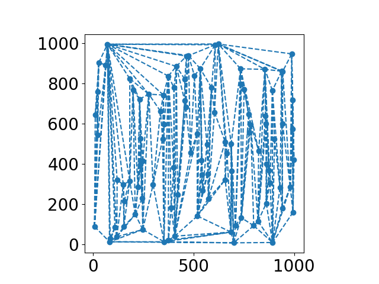
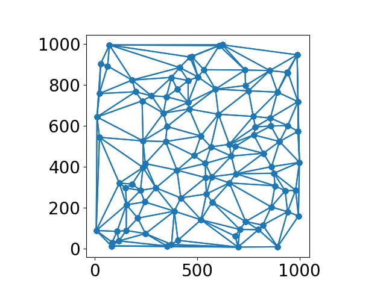

# Planar Triangulations

## Context
This project was done for the TIPE test of the french preparatory class exams.

## Goals

Goal of this project is to compare multiple triangulation algorithms, with a special focus on Delaunay Triangulation algorithms. 

<figure>
   
  <figcaption style="text-align:left"><em>Set of points triangulation. Left: Non Delaunay triangulation, right: Delaunay triangulation.</em></figcaption>
</figure>

## Description

This project contains multiple algorithms creating a planar non constrained triangulation given a set of points. Those algorithms are
1. Incremental algorithm that creates a simple triangulation with a time complexity $O(n\log n)$, presented in part 12.1.2 of: *Algorithmic Geometry*, J.D. Boissonnat, M. Yvinec, Cambridge University Press 1998, ISBN, 0 521 56322 4.
2. Bowyer-Watson algorithm that creates a Delaunay triangulation in $O(n^2)$, presented in *Computing Dirichlet Tesselations*, A. Bowyer, The Computer Journal Vol.24 No.2 1981, Hayden & Son Ltd
3. Divide and Conquer algorithm that creates a Delaunay triangulation in $O(n\log n)$, presented in *Two algorithms for constructing a Delaunay Triangulation*, D.T. Lee, B.J. Schachter, International Journal of Computer and Information Sciences, Vol.9, No.3, 1980

## File architecture and usage
- `tests_2.py`: Main script. Uncomment the different parts to launch computations with desired algorithms. Possible to generate random set of points and to plot relation between computation time and size of set of points.
- `donnees_2.py`: gathers functions that create set of points on specific geometric shapes such as triangles and squares.
- `primitive_points_aretes_2.py`: gathers all the geometric functions and the class `Triangle`.
- `creation_triangulation_2.py`: gathers function that create the various triangulation and that display them.
- `ndt_algo4.py`: gathers class of Non Delaunay triangulation built with incremental algorithm.
- `bw_classes_3.py`: gathers class of Delaunay triangulation built with Bowyer-Watson algorithm.
- `dc_valide.py`: gathers class of Delaunay triangulation built with Schachter-Lee algorithm.
- `complexité_temporelle_2.py`: gathers all functions that compute execution times of algorithms and their relations with size of set of points.
